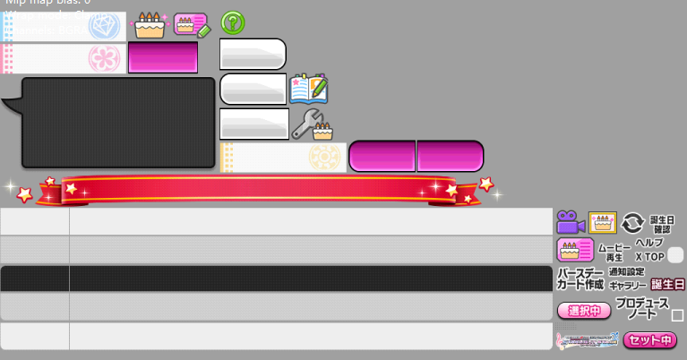
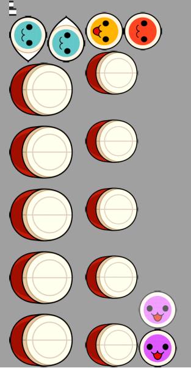
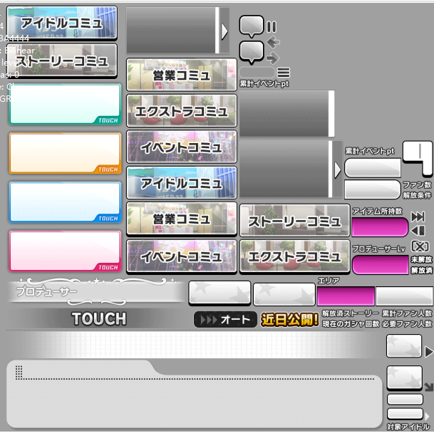
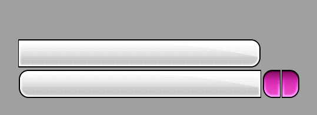
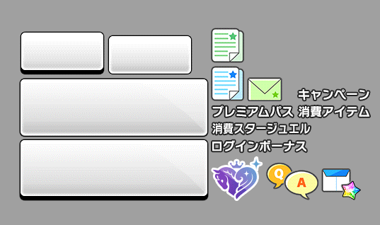
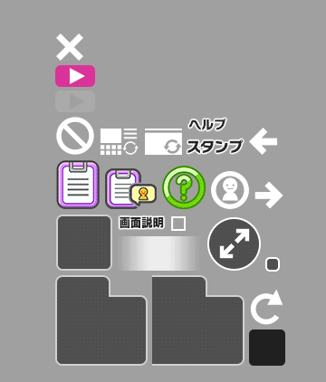

# 文件查找
## 记录下自己发现的文件记录顺便分下类

## 

### 生日素材
 ```
    生日办公室背景
    anime_fl_btd_birthdayanime_00.unity3d
    anime_fl_btd_birthdaytop_00.uniity3d
```
应该是生日时的对话ui

```
    atlas_birthday.unity3d
```
### live
``` 
    live结束和live练习模式相关ui
    anime_fl_tutorial_main_00 or 01 or 02 .unity3d
    anime_fl_tutorial_liveresult or touchicon_XX.unity3d
```
```
    音符，属性，连击，能量框等等ui，算是最全的了 每个文件对应不同场景
    live_atlas_liveui.unity3d 
    live_atlas_liveuiadd.unity3d
    live_atlas_liveuiaddsmallline.unity3d
    live_atlas_liveuiwithoutnote.unity3d
    live_atlas_liveverticalui.unity3d
    live_atlas_liveverticaluiadd.unity3d
```
```
    Grand模式 ui
    live_atlas_notegrandui_01_01~04.unity3d　每个都有＿anim版（加_anim即可）
    live_atlas_notegrandui_02~03_00.unity3d ui颜色不同
```
应该是按键的皮肤,图为05的太鼓

```
    live_atlas_noteui_01~21.unity3d
```

### 抽卡
```
    抽卡出货ui
    anime_fl_anc_cardintroduce_00 or 01 or 02 .unity3d
```
```
    卡池图片
    tutorial_individual_tutorial_卡池id_XX.unity3d
```
### 剧情ui
```
    疑似新手教程对话ui（御三家的表格和对话框）
    atlas_tutorial.unity3d
```
最基础的ui，剧情界面一级菜单的ui和对话框

```
    atlas_story.unity3d
```
全是长框框，有五种放一种

```
    atlas_tabbutton_button2~6.unity3d
```
不知道改叫什么，看图好了

```
    atlas_support.unity3d
```
应该是剧情菜单了

```
    atlas_telescopeatlas.unity3d
```
## Spine小人
Spine小人在数据库搜索%Spine%，相关的资源就基本全出来了
